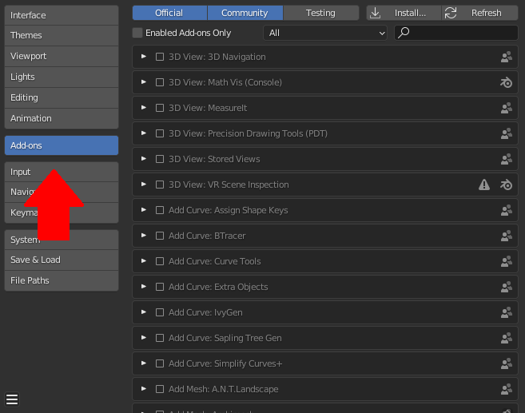
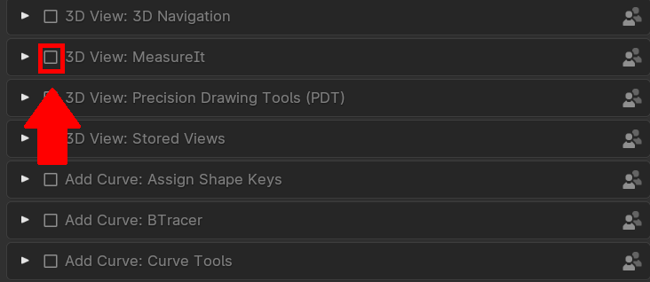

<link rel="stylesheet" href="style.css">

[<<Table of Contents](README.md)
# Overview

Blender is an awesome software in its own right, however the default software may be missing some key features that you need for this reason the open source community has built in addon support to blender. In the forms of Official (add ons made by official blender developers), and community (addons made by individuals, or other groups than the blender organization. ) addons

# Enabling Official Blender Add-ons

 Luckily the built in blender plugins are failry easy to enable as belnder by default has some plug ins downloaded and they simply need to be enabled.

## 1. Open the preference menu 
   
   You can open the preference by either pressing 'Control + ,', or Clicking `Edit > Preferences`
## 2. Click on Add-ons

 

Here you will see A list of blender addon, to filter what type of addon you want to see you can click on the official, or community headers to turn on or off filtering there results (Light Blue for enable, grey for disabled.)

## 3. Enable the plug-ins

Enable/disable the plug in you wish by simply by just checking on or off the box located to the side of its title.

# Installing a plug in 

## 1. Find the plug in you wish to install

Ensure that the plug in you wish to install is safe, and that it is saved in the `.py`, or `.zip` formats.

**If it is in the `.zip` format do not extract the `.zip` file**

## 2. Open the preference menu 

You can open the preference by either pressing 'Control + ,', or Clicking `Edit > Preferences`

## 3. Click on Add-ons

## 4. Click on Install 

You will then be prompted to navigate to the directory where the plug in is saved, once you have located the add-on select the add-on and then click `install add-on`.

## 5. Enable the Addon

By default the addon is not enabled, to get it started simply look up the add-on and then enable to the add on by checking the box to the side of it. 

[<<Table of Contents](README.md)