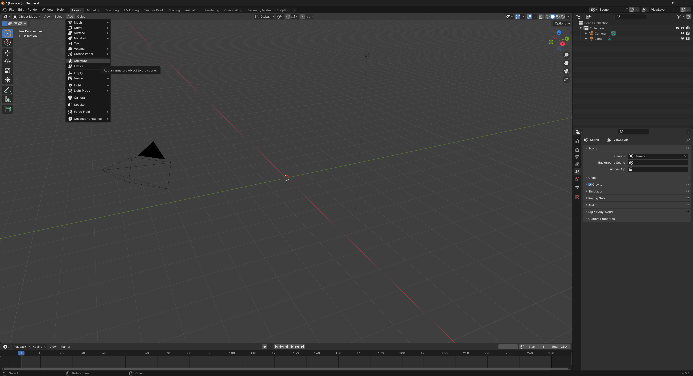
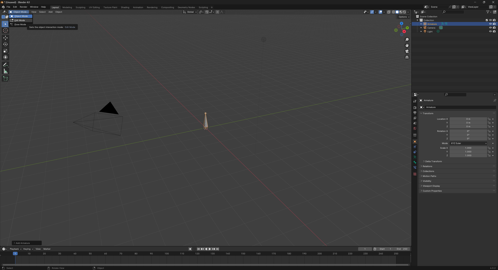
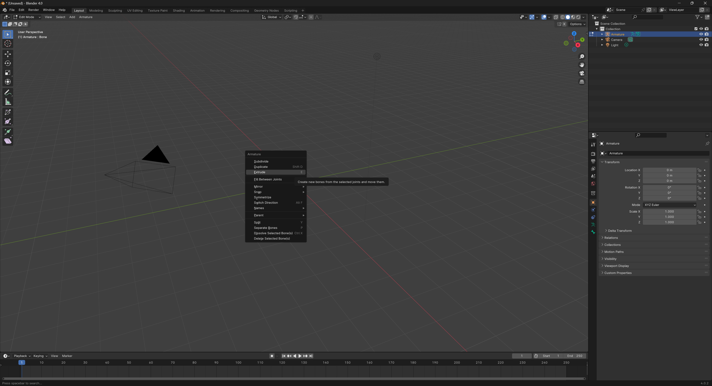
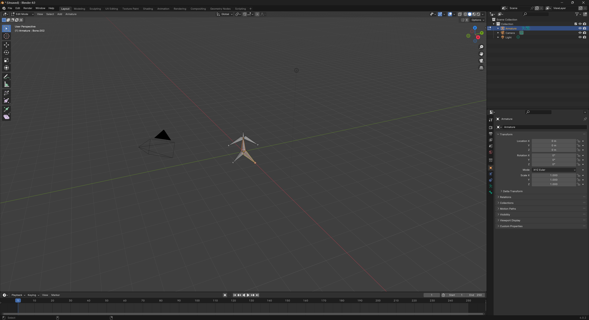
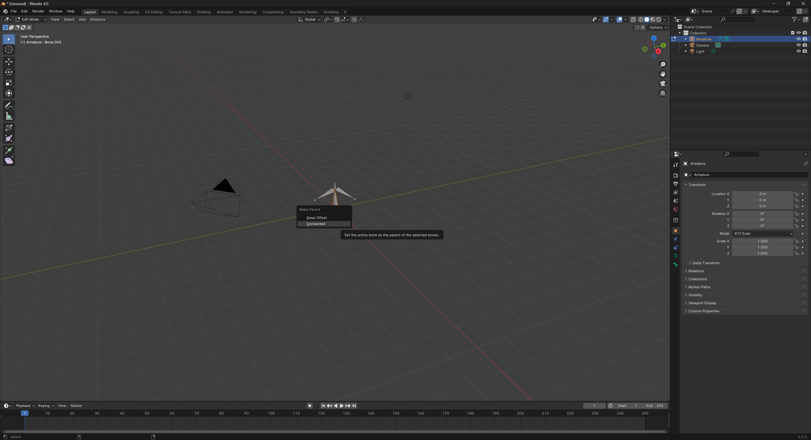

<link rel="stylesheet" href="style.css">

[<<Table of Contents](README.md)

# Armature Bones
*Written by: Grant Nelson*

## Summary
This guide will demonstrate how to create and manipulate Armature Bones in Blender, essential for character rigging and animation. We will cover the following sections:
- [Setup and Adding Armature](#setup-and-adding-armature)
- [Creating and Positioning Bones](#creating-and-positioning-bones)
- [Parenting and Bone Relationships](#parenting-and-bone-relationships)

## Setup and Adding Armature
1. Open a new or existing Blender project where you want to add Armature.
2. In the **Layout** workspace, ensure your 3D model or the area where you want to create bones is visible.
3. To add an Armature, go to the **Add** menu, and select **Armature**.
   
4. A single bone will appear in the viewport. If not visible, zoom out or reposition the view.

## Creating and Positioning Bones
1. With the Armature selected, switch to **Edit Mode** using the dropdown menu at the bottom left of the viewport or press `Tab`.
   
2. Select the tip or base of the bone, then use the **Extrude** tool (Either open the Armature menu with `Right Click`, or press `E`) to create a new connected bone.
   
3. Position the new bone accordingly by moving it to the desired location in the model. Repeat the extrusion process to create a chain of bones that matches your model's structure.
4. Use the **Rotate** and **Scale** tools to adjust each bone's orientation and size to fit your model.

## Parenting and Bone Relationships
1. In **Edit Mode**, select the child bone, then `Shift`-click the parent bone to select both.
   
2. Press `Ctrl+P` to open the parenting menu and select **Keep Offset** to maintain the current position or **Connected** to directly connect the bones.
   
3. To create a more complex rig, continue to define relationships between bones, ensuring proper hierarchy for realistic movement and control.

By following these steps, you should now have a basic understanding of creating and manipulating Armature Bones in Blender. This foundational knowledge is crucial for rigging characters and creating animations. 

[Back to Top](#blender-armature-bones)

[<<Table of Contents](README.md)