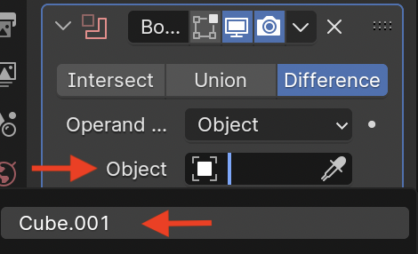

[<<Table of Contents](README.md)

# Boolean Modifier
*Written by: Thomas Nelson*

## Summary
This tutorial goes demonstrates how to use the Boolean Object Modifier in Blender. It is a modifier for objects that allows you to create unique and complex shapes and cutouts by using multiple simple shapes. There will be three sections in this tutorial:
1. [Setup](#setup)
2. [Enabling the Boolean Modifier](#enabling-the-boolean-modifier)
3. [Trying out each Boolean mode](#boolean-modes-and-how-to-view-the-modified-shape)

This tutorial assumes that you have basic knowledge of [navigating the viewport](https://youtu.be/ILqOWe3zAbk?si=7SHFtHqRjD0HJ4d0), [UI](https://youtu.be/8XyIYRW_2xk?si=zj8Ny7yR1xVeKAYQ), and [selecting/transforming objects](https://youtu.be/hTL6AKR8YDs?si=xMJa8COjAnLb22Wz) in Blender. If you would like a more comprehensive tutorial experience, I would suggest watching Blender's ["Fundamentals" YouTube series](https://youtube.com/playlist?list=PLa1F2ddGya_-UvuAqHAksYnB0qL9yWDO6&si=a-3UHM_G6K4EPjtN).

## Setup
1. Start a new project in Blender. The project should open to the basic cube, camera, and light.
    + Ensure that the **Layout** tab is selected.

2. Select the **Add Cube** tool

3. Create a cube that is *smaller* than the cube that was made on project creation. To use the Add Cube tool:
    1. Click and drag anywhere in the viewport. Hold left shift to keep the selection square. Release the click when you have reached the desired size.
    2. Hold shift again and click to create a perfect cube!
    3. If you mess up at any point, use <code>Ctrl+Z</code> or <code>Cmd+Z</code> to undo what you have done
If done correctly, you should have something similar to the following:

4. Move the smaller cube to intersect with the other cube. You can intersect it in any way, as long as they do.

## Enabling the Boolean Modifier
Once done with [setup](#setup), you can now add the boolean modifier to you shape.
1. First, select the bigger box by either clicking on it in the viewport or by clicking on its name in the top-right **Scene Collection** tab. Its name should just be "Cube" (not Cube.001).

2. On the right side of the screen, underneath the **Scene Collection** section, you should see a pane with several tabs. Select the **Modifiers** pane with icon 
3. On the Modifiers screen, click the "Add Modifier" button.
4. Once clicked, you should see the modifier creation menu (shown below). Once here, use the search bar to search "boolean". Click the first result.

5. You now have a boolean modifier added to "Cube". Now you must relate "Cube" (your larger cube) to "Cube.001" (your smaller cube). To do this, in the modifier you created, click the "Object" field. Then select "Cube.001".

6. The two objects are now related! Now you can start creating specialize shapes.

## Boolean Modes and how to view the modified shape
Now that [setup](#setup) is complete and the [boolean modifier](#enabling-the-boolean-modifier) has been enabled, we are now ready to test and view each mode. We will start by figuring out how to view the modified shape.
### Viewing the shape
Since the shape is now modified, it doesn't appear any different currently. This is because the object "Cube" is related to (Cube.001) is still visible. To turn it invisible, click the eye icon   next to "Cube.001" in the **Scene Collection** window. If done correctly, you should see something like this:

As you can see, "Cube" is now indented where "Cube.001" is! This is the result of the Difference mode for the Boolean modifier. The shape is now "Cube" minus "Cube.001", which results in what you see above.
