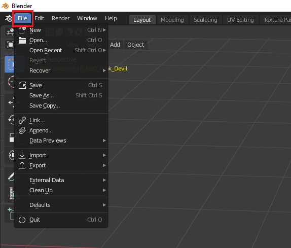
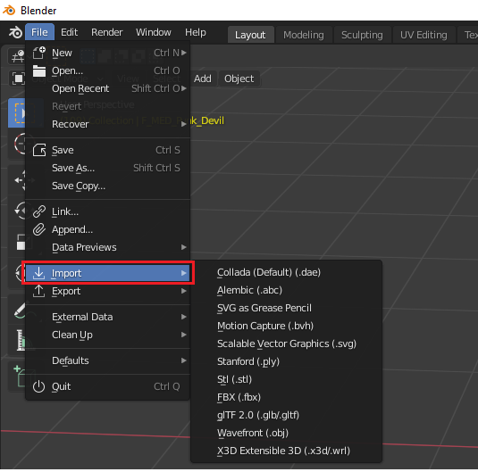
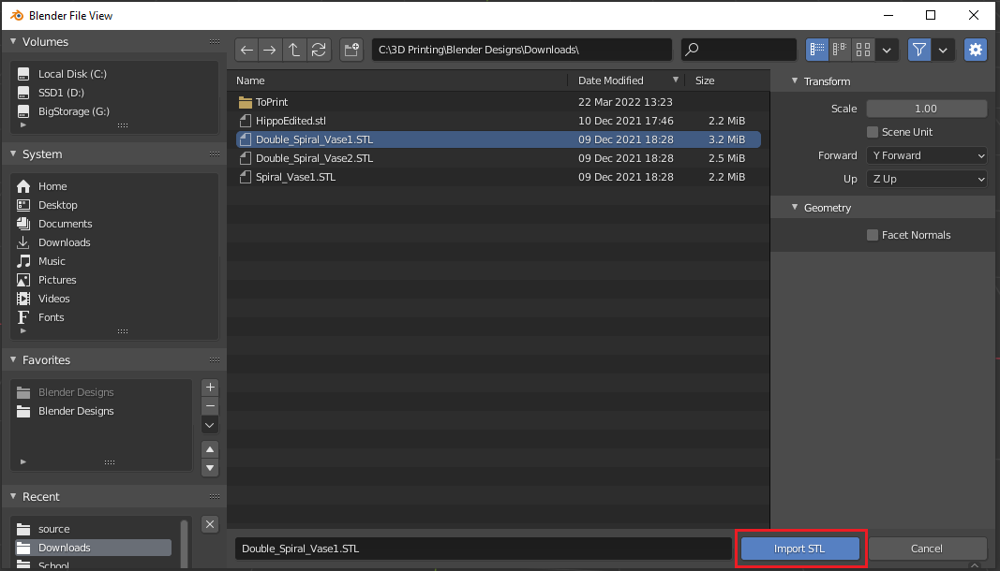
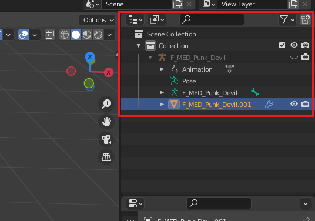
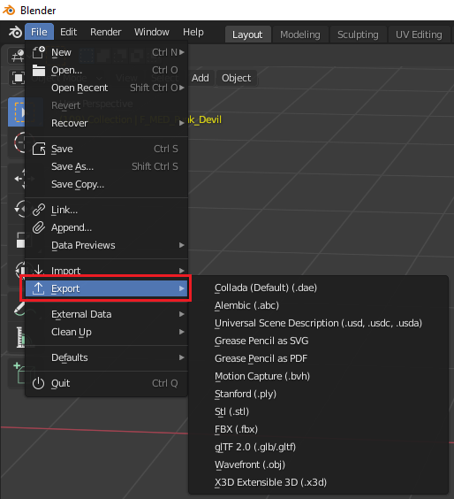
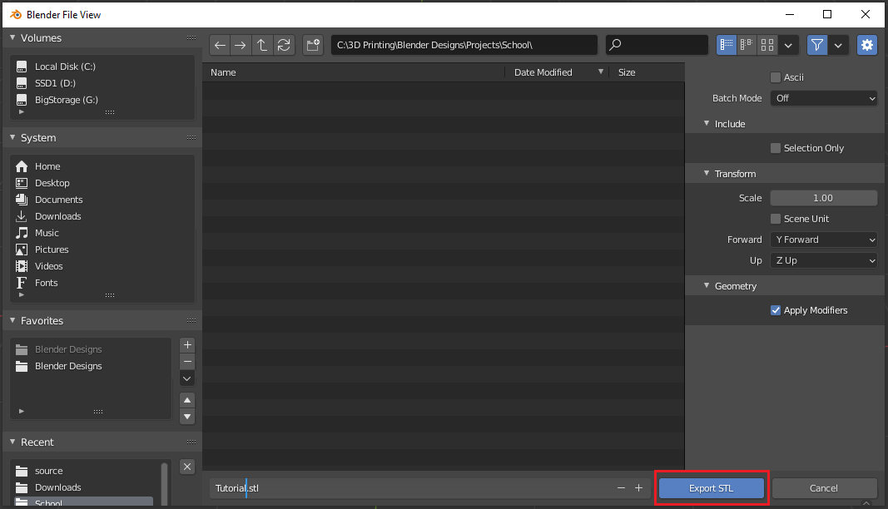

<link rel="stylesheet" href="style.css">

[<<Table of Contents](README.md)

# Imports and Exports
*Written by: Weston Johnson*

## Summary
This tutorial demonstrates how to export or import an object or project in Blender to or from a specified file type. The specific file types and the pros and cons associated with each type can be found on [Blenders Website](https://docs.blender.org/manual/en/latest/files/import_export.html).
- [Importing Files](#importing-files)
- [Exporting Files](#exporting-files)

This tutorial assumes that you have basic knowledge of [navigating the viewport](https://youtu.be/ILqOWe3zAbk?si=7SHFtHqRjD0HJ4d0), and [UI](https://youtu.be/8XyIYRW_2xk?si=zj8Ny7yR1xVeKAYQ).

## Importing Files
Importing an object to a blender scene is a big part of development and design. Importing can be used to collaborate with other developers on your team, or it can also be used to import from online sources you have access to. 

1. Open the project you want to import an object to. This can be a new project or an existing project.
2. Click on the **File** button in the upper left hand corner for the drop-down.

 
 
3. Hover over **Import** to reveal the selections of file types compatible for importing.
4. Click on the file type that you are importing with.

 
 
5. Navigate to the location of the file you want to import within the Blender File View.
6. Click on the file you are importing and click the **Import** button.

 
 
7. The object that you import will be highlighted automatically when it finishes importing.

## Exporting Files
Exporting a blender scene or object to a file is an essential part of development and design in blender. In many circumstances, you will use an exported file as method of producing a final product. STL files are a common file used in 3D models for manufacturing purposes i.e. 3D printing, CNC models. 

1. Open the project you want to export from. The project can contain more than just the object you want to export.
2. Select all of the objects on the right hand side in the scene collections area that are used in creating the object you want to export. NOTE: If you export without anything selected, Blender will export everything in the blender project including objects that are hidden.

 
 
3. Click the **File** drop-down button in the upper left-hand corner.

 
 
4. Hover over **Export** to reveal the file types and select the file type you want to export the selection as. This should bring up a Blender File View window.

 
 
5. Navigate to the location you want your exported file to be saved.
6. Name the file you are exporting and click the **Export** button. This will export your selection to the location you selected in the window.

[<<Table of Contents](README.md)

[Back to Top](#rendering-output)
