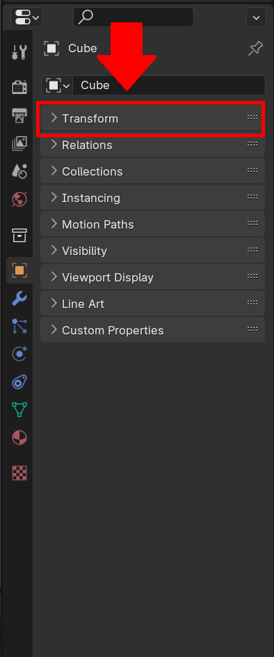
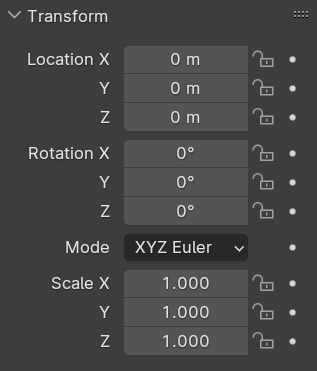

# Scaling Models
<information>
Below is a standard cube in the traditional blender project layout, in order to be able to manipulate the size of thè object it is best to move to the **Layout** Tab.
</information>

1. Selecting the object you wish to resize/move/rotate by clicking on it in the workspace, or clicking on its label in the scene layout pane. 
2. Open the **Object** pane as denoted by a "".  
3.  Select the **Transform** tab in the **Object** sub-menu. <information>The tranform menu is how can precisely move, turn, and stretch an object. It is split into 3 sections *location*, *Rotation*, and *Scale* with each of these menus split into *X*, *Y*, and *Z*.</information>

# Industry standard sizings

<information>
When it comes time to build out a 3d model for a part often what comes up is how do I maintain a consistent scale through out my project to maintain interoperability, so that when it comes time to assemble the parts all work together seamlessly. This is often done through the setting a common conversion through out your project. By default most industry use the 1 unit = 1 mm standard when it comes to sizing for 3d prints. However larger more industrial groups use ____. However one of  the key ways to promote interoperability is through the use of standardized connectors. These include nuts, bolts, motors, and other select parts. So in this section we will walk through how to add industry standard parts to your projects. 
</information>

# Downloading the required models

## Where to go 

For the models 

## importing the models

# Adding the models

## Scaling the models

## Joining the models.

## Boolean cuts. 

Export Link