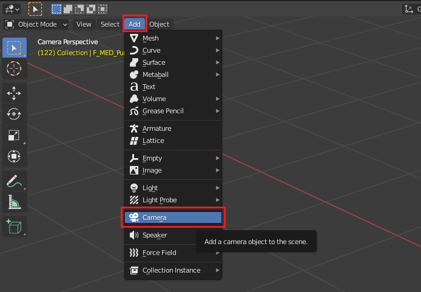
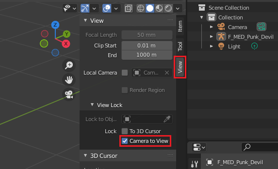
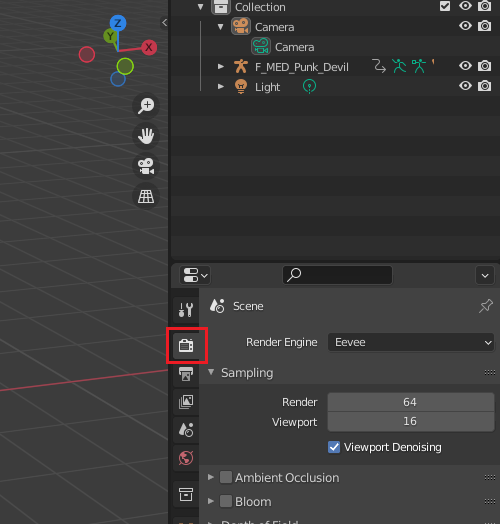
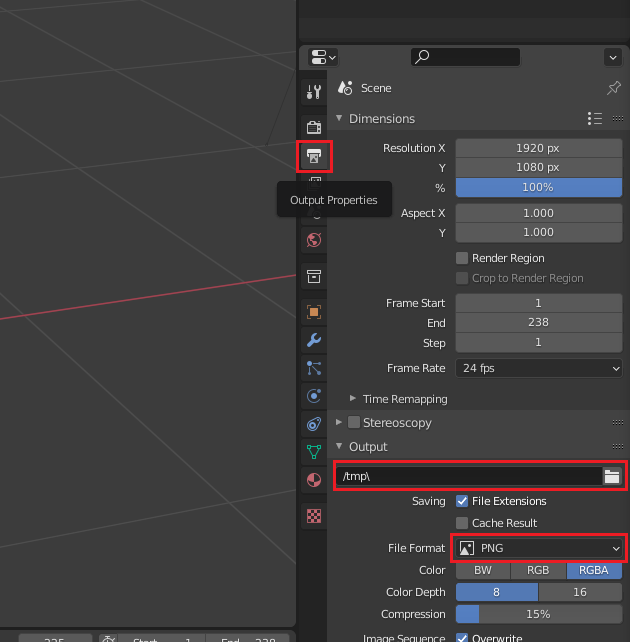
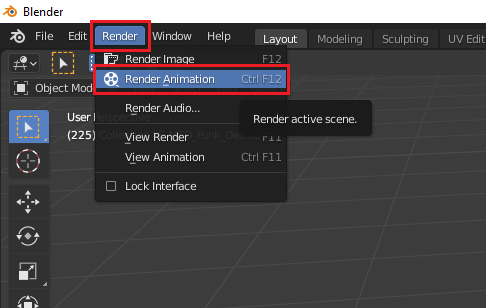
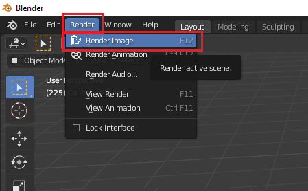

<link rel="stylesheet" href="style.css">

[<<Table of Contents](README.md)

# Rendering Output
*Written by: Weston Johnson*

## Summary
This tutorial demonstrates how to render a project in Blender. Rendering is taking a 3D model or animation, and outputting that to a 2D image. There are two major categories of rendering projects in blender, image based rendering, and animation based rendering. Both will be covered in the tutorial.
- [Animation](#animation-rendering)
- [Image Rendering](#image-rendering)

This tutorial assumes that you have basic knowledge of [navigating the viewport](https://youtu.be/ILqOWe3zAbk?si=7SHFtHqRjD0HJ4d0), and [UI](https://youtu.be/8XyIYRW_2xk?si=zj8Ny7yR1xVeKAYQ).

## Animation Rendering

Rendering an animation will allow you to view individual frames of the finished animation. Animations are just series of images, or frames, that are played consecutively. Being able to analyze animations frame by frame can allow for detailed editing and can also provide a good way to spot any problems with your animation.

1. Open the project you want to render.
2. Set up your camera at the position you want to render from.
   1. Add a camera object if you don't have one in the scene.
      - Click the **Add** button to reveal the drop down list of objects to add.
      - Click the **Camera** button to add a camera
        
      
      
   2. Right-click on the camera and select **Set Active Camera**
   3. Press n on your keyboard to open a view panel.
   4. Click the **view** tab to open the tab.
   5. Select **Camera to View**
      - This will lock the camera to your view so you can adjst the location and angle of the camera.
        
      
      
   6. Move the camera to your desired position and angle.
   7. Uncheck the **Camera to View** box when you are finished re-positioning the camera.
3. Set your rendering options for your desired output
   1. Select the **Render Properties** tab from your list of properties.
     
   
   
   2. Adjust the necessary settings in under the scenes rendering options.
      - This can take time and will be different for every scene you render for. Depending on the **Rendering Engine** you choose to use these settings control the sampling rate, noise, depth of field, blurs, and much more. For more information on the details of the rendering settings refer to the [Blender Documentation](https://docs.blender.org/manual/en/latest/render/index.html).
      
      

4. Select the **Output Properties** tab from your list of properties.
     
   
   
5. Verify or change the output file location and format. This will be where the rendered animations get saved with the default being in the /tmp\ directory.
   -  Best practice is to save each render you do to a seperate location to avoid confusion.
6. Select the **Render** tab on the top left of the screen for the render drop down.
     
   
   
7. Select **Render Animation**. DO NOT close the new window that pops up, this is the rendering window and closing it will cancel the rendering. You can navigate to the directory that you chose for the rendering to be output to, this will allow you to see each frame as it gets rendered and saved to the file.

## Image Rendering

Rendering an image in blender will turn your 3D scene into a 2D image. This can be used to take photos of your blender creations to be shared or saved. Rendering an image can be used by a designer to show another person the current progress of a design without having to export the object as a file and instruct the recipient on how to view the exported file.

1. Open the project you want to render.
2. Set up your camera at the position you want to render from.
   1. Add a camera object if you don't have one in the scene.
      - Click the **Add** button to reveal the drop down list of objects to add.
      - Click the **Camera** button to add a camera
        
      
      
   2. Right-click on the camera and select **Set Active Camera**
   3. Press n on your keyboard to open a view panel.
   4. Click the **view** tab to open the tab.
   5. Select **Camera to View**
      - This will lock the camera to your view so you can adjst the location and angle of the camera.
        
      
      
   6. Move the camera to your desired position and angle.
   7. Uncheck the **Camera to View** box when you are finished re-positioning the camera.
3. Set your rendering options for your desired output
   1. Select the **Render Properties** tab from your list of properties.
        
      
      
   2. Adjust the necessary settings in under the scenes rendering options.
      - This can take time and will be different for every scene you render for. Depending on the **Rendering Engine** you choose to use these settings control the sampling rate, noise, depth of field, blurs, and much more. For more information on the details of the rendering settings refer to the [Blender Documentation](https://docs.blender.org/manual/en/latest/render/index.html).
      
      
4. Select the **Output Properties** tab from your list of properties.
     
   
   
5. Verify or change the output file location and format. This will be where the rendered images get saved with the default being in the /tmp\ directory.
6. Select the **Render** tab on the top left of the screen for the render drop down. This will render the current active screen from the point of view of the camera.
     
   
   
7. Select **Render Image**. DO NOT close the new window that pops up, this is the rendering window and closing it will cancel the rendering. Wait for the rendering to complete.

[<<Table of Contents](README.md)

[Back to Top](#rendering-output)
