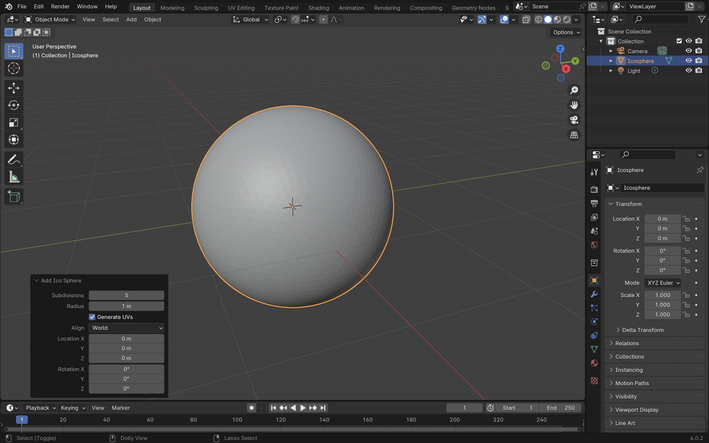

<link rel="stylesheet" href="style.css">

[<<Table of Contents](README.md)

# Sculpting Tools
*Written by: Thomas Nelson*

## Summary
This tutorial goes demonstrates Blender's basic sculpting tools and how to use them. There will be four sections in this tutorial:
1. [Setup](#setup)
2. [The Sculpting Mode](#the-sculpting-mode)
3. [Sculpting Tool Settings](#sculpting-tools-settings)
4. [Using a Sculpting Tool](#using-a-sculpting-tool)

This tutorial assumes that you have basic knowledge of [navigating the viewport](https://youtu.be/ILqOWe3zAbk?si=7SHFtHqRjD0HJ4d0), [UI](https://youtu.be/8XyIYRW_2xk?si=zj8Ny7yR1xVeKAYQ), and [selecting/transforming objects](https://youtu.be/hTL6AKR8YDs?si=xMJa8COjAnLb22Wz) in Blender. If you would like a more comprehensive tutorial experience, I would suggest watching Blender's ["Fundamentals" YouTube series](https://youtube.com/playlist?list=PLa1F2ddGya_-UvuAqHAksYnB0qL9yWDO6&si=a-3UHM_G6K4EPjtN).

## Setup
Sculpting in Blender depends moving the individual vertices of a shape or object. Simple shapes, like the cube, have a small amount of vertices (in the case of the cube, eight, one for each corner), which is limiting in terms of sculpting. 

For more satisfying results, shapes with more vertices are required. With this in mind, we will use the **Ico Sphere** in this tutorial to demonstrate the various sculpting tools' capabilities.

To setup:
1. **Open** a new project.
2. **Delete** the cube that came with the default project by selecting it, pressing <code>X</code>, and then pressing <code>Enter</code>.
3. **Add** an Ico Sphere to the project by clicking "Add", hovering over "Mesh", and then clicking "Ico Sphere".

4. **Click** the "Add Ico Sphere" menu in the bottom left of the viewing pane.

5. In the menu opened by the last step **click and drag** the subdivisions bar so that there are 5 subdivisions in the Ico Sphere

You will see something similar to this after zooming in:

You will see that the Ico Sphere has become far more spherical. If you zoom in, you will see that the Ico Sphere has isn't completely sphereical; you will be able to see lots of individual vertices. This is good! Setup is complete.

## The Sculpting Mode
The Sculpting Mode is specifically designed with sculpting in mind, and as such has removed things like gridlines from view in favor of focusing on the object being sculpted.

To access the Sculpting mode:
1. Click the "Sculpting" tab. It is on the very top bar of the screen, right of "Layout" and "Modeling," as seen in the following picture:

### Sculpting Tools Location
There are several different sculpting tools available to use. You can find them on the left hand of the screen while in Sculpting mode:

## Sculpting Tools Settings
While there are many tools, they all share similar settings. We will go over two important ones:

### Radius
This setting controls the brush size of the tool you are using. This setting is located near the top-left of the screen, just above the viewport. To change the radius of the brush, there are two options:
- Click the Radius Setting, and type your desired brush size in pixels

- Click and Drag the Radius Bar left or right to adjust to your desired size in pixels
 

### Strength
This setting controls how impactful the tool is on the model. The higher the strength, the more change you will see on the model. This setting is found on the top bar of the viewport, next to the Radius setting. To change this setting, there are two options:
- Click the Strength Setting, and type your tool strength in decimal (0.0 to 1.0)

- Click and Drag the Radius Bar left or right to adjust to your desired strength

## Using a Sculpting Tool
To use a sculpting tool, select one from the left side of the viewport. For this tutorial, we will use the "draw" tool, the first and most simple one. It extrudes vertices within the brush radius.
1. Select the "Draw" tool (or other desired tool)

2. Click and drag across the target area.

If you ever make a mistake, always feel free to use <code>Ctrl+Z</code> or <code>Cmd+Z</code> to undo your previous actions.

### End of Tutorial

This is the end of the tutorial! Please experiment with the different tools that are available!

[<<Table of Contents](README.md)

[Back to Top](#rendering-output)