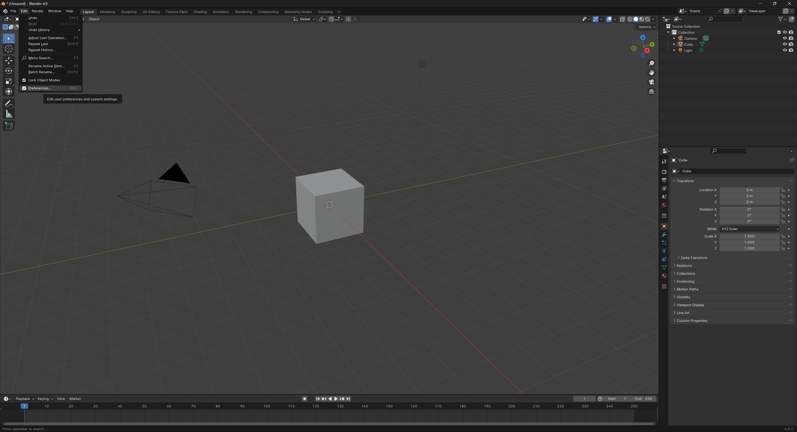
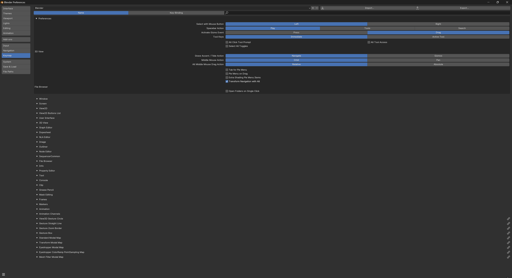
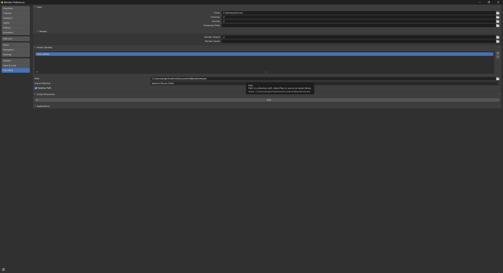
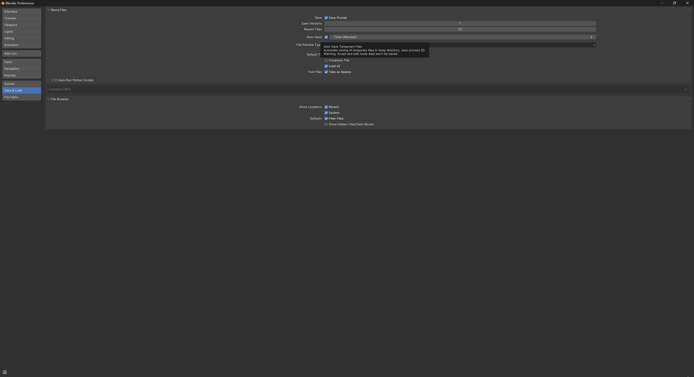
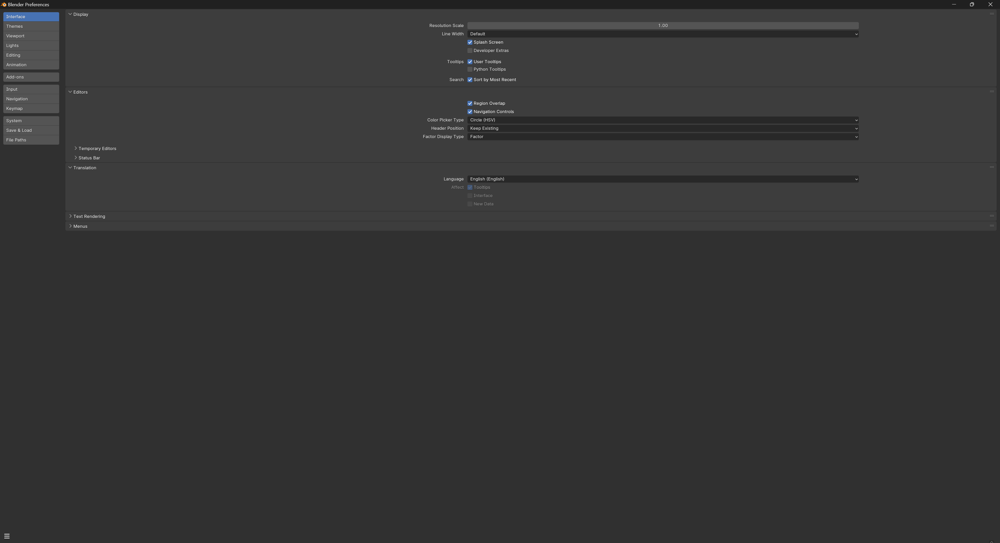
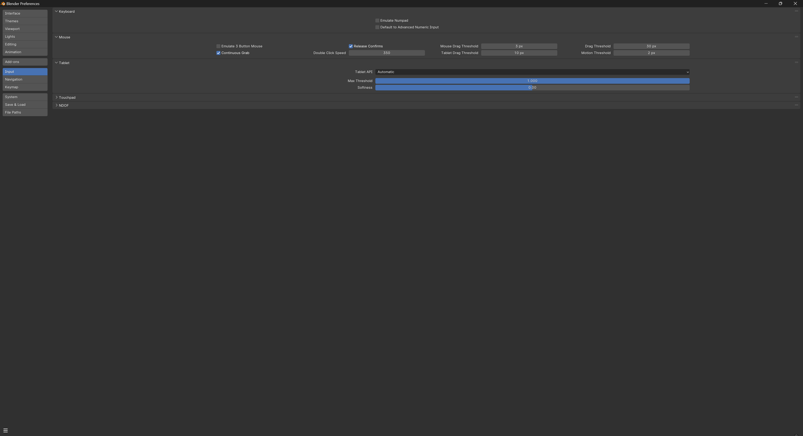
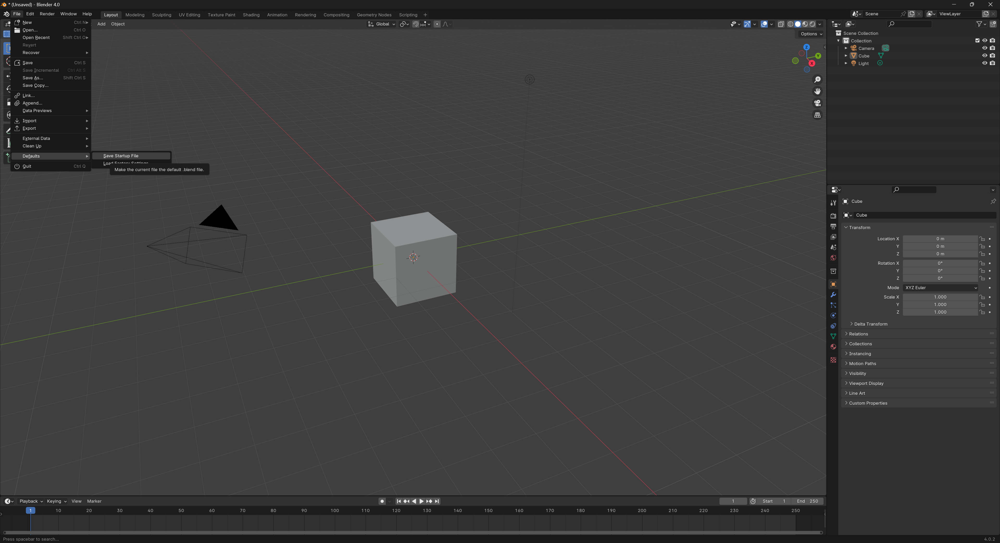
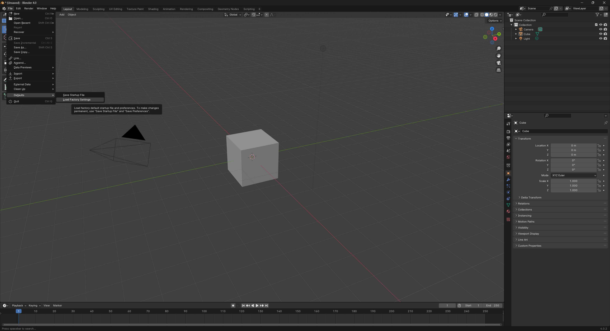

<link rel="stylesheet" href="style.css">

[<<Table of Contents](README.md)

# Settings Configuration
**Written by: Grant Nelson**

Welcome to the Blender configuration guide, designed to optimize your 3D modeling and animation workflow. This guide will cover the most essential configuration settings and adjustments.

## Accessing Preferences Menu

To navigate to the the Preferences menu, access `Edit > Preferences' using the navigation bar at the top of the screen.

### Language
Access `Edit > Preferences > Interface` to set your preferred language, enhancing your user experience by localizing the Blender interface.

### Input Keymaps
Configure input keymap settings under `Edit > Preferences > Keymap` to better suit your workflow.

### File and Paths
Set default file paths for images, textures, and renders in `Edit > Preferences > File Paths` to streamline project organization.

### Save & Load
Adjust auto-save settings and file versioning under `Edit > Preferences > Save & Load` to protect your work and manage file history.

## Configuring Peripherals

### Displays
Optimize your display settings, including window resolution and editor display settings, in `Edit > Preferences > Interface`.

### Input Devices
Tailor settings for mice, keyboards, and tablets in `Edit > Preferences > Input` to enhance interaction with Blender's tools and features.

## Defaults

### Import Existing Settings
Import settings from previous Blender installations or configurations via `File > Defaults > Load Factory Settings`, then `Edit > Preferences` to fine-tune as previously described.

### Create New Defaults
Adjusted preferenses are automatically changed when saved. To customize your startup file with preferred objects, lighting, and camera setups, configure them in your current project and save via `File > Defaults > Save Startup File`.

### Loading Factory Settings
Revert to Blender’s original settings at any time by selecting `File > Defaults > Load Factory Settings`, providing a clean slate for configuration.

---

By following this guide, you can efficiently configure Blender to match your personal preferences and requirements, leading to a more productive and satisfying 3D creation experience.

[Back to Top](#settings-configuration)

[<<Table of Contents](README.md)