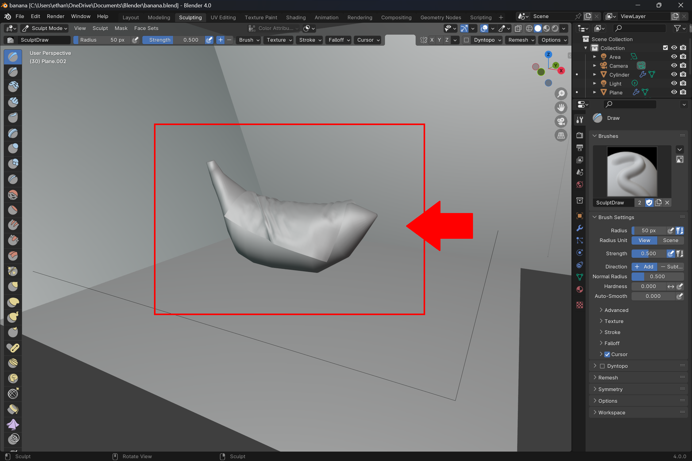

# Text

## Body Text

<information>
All body text should be left justified with 12 pt font throughout. With informational text signified by times new roman, and action text should be kept to arial
</information>

## Lists

<information>

Lists can only be in the bulleted, and numbered formats. With smaller subsections of list items. Denoted a tab indent and a change in marking. 

Example:
### Numbered
1. Instruction
 
    a. subtask
2. Instruction

### Bullet
- Information
  - More In depth 
    - Extremely In Depth

</information>

## Headings

<information>
Headings are based on traditional markdown headings with main topics in the largest size, the headings should get progressively smaller as the section gets more specific.All of these headings should be represented in the table of contents. 
</information>

###  Heading Color

<information>

- Main headings should be orange. #e87d0d
- Sub headings should be blue. #265787

# Example Main Heading
## Example Sub Heading 2
### Example Sub Heading 3
#### Example Sub Heading 4
##### Example Sub Heading 5
###### Example Sub Heading 6
</information>

## Table of Contents

The table of contents should be ordered by the basic set up, followed by the rest of the contents in A-Z order with subheadings also noted. All of the sections should function as clickable links. 

A Demonstration of a table of contents following this format. For the purpose of this demo the items are not clickable, and filled with generic options, as most of these are way out of the scope of the project

# Getting Started
- Requirements
- Install 

# Assembly and Composition
- Combining Multiple Models
- Creating Assemblies and Hierarchies
- Joints and Constraints

# Customization and Settings
- Personalization Options
- Preferences
- Configuration Settings

# Export
- Exporting to Different File Formats

# Import
- Loading Existing 3D Models
    
# Model Manipulation
- Translation, Rotation, and Scaling
- Grouping and Ungrouping Objects
- Mirroring and Symmetry

# Sculpting
- Using the add tool
- Stretch

# Texturing
- Digital Sculpting Tools
- Applying Materials and Textures
- UV Mapping

# Visualization and Rendering
- Real-Time Preview
- Lighting and Camera Setup
- High-Quality Rendering

# Styling

## Images
<information>

Images should break the text and fill the sides, to make them more visibly seen as a separate part of instructions. All images should also labeled to keep in line with accessibility concerns. (Note: image descriptions should not start with "Image of ..." or the like as screen readers used by the visibly impaired will already denote them as images.)

For images that are used to highlight menus, options a red (#ff0000) box should be placed around the necessary UI. The selected UI should follow standard default UI to avoid confusion.

Example:

</information>

## Color Pallette

<information>

Colors are based upon the blender logo, to keep style consistency with the brand logo of orange, and blue. The blues are to be kept to #265787,  and the oranges are to be kept to #e87d0d. 

Orange   . . . .  

Blue  . . . .  
</information>

## Logos
The following logo should be the used throughout.
 
