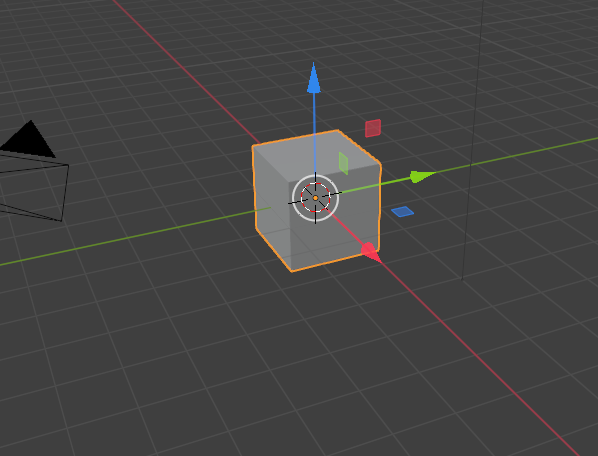
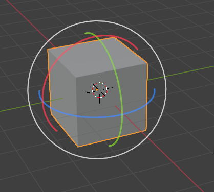
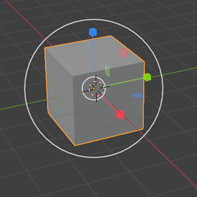
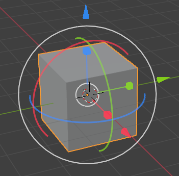
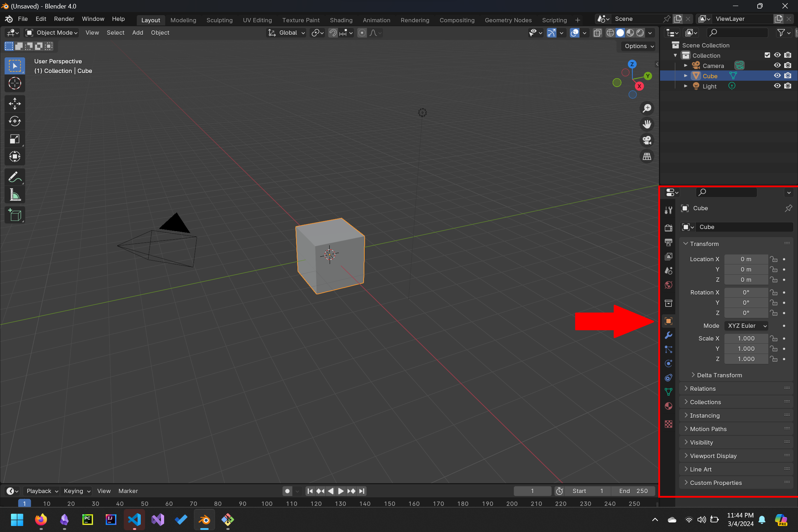
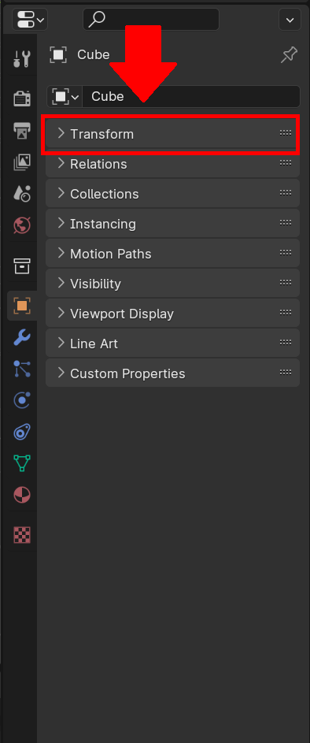
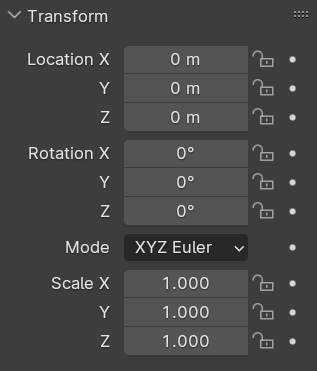

<link rel="stylesheet" href="style.css">

[<<Table of Contents](README.md)

# Overview

One of the most common things you will have to do is precisely placing and moving objects for your projects, because blender is a 3d software there are a variety of ways to do this. 

# Selecting the Object
First Begin by selecting the object you wish to resize/move/rotate by clicking on it in the workspace, or clicking on its label in the scene layout pane the

# Quickly Transforming an Object

## Moving 

The move tool is often the defacto way to quickly shift where are objects are in a given scene.

### Selecting the move tool. 
To select the move you can click the  location in the left toolbar, or press 'Shift+Space' followed by 'G'.

### Quickly Moving an object

To quickly move an object in a scene, this can be done by grabbing the circle in the center of an object and then sliding the object to the desired position. 

### Moving Along An axis

In order to move an object exclusively across a single axis you can simply grab the representative arrow for its axis and drag and hold to slide it along its axis. 
- Blue arrow: Z-axis (vertical)
- Green arrow: Y-axis (up/down)
- Red arrow: X-axis (left/right)

## Rotating 

The rotate tool allows you to change the orientation of objects in your scene.

### Selecting the rotate tool

To select the rotate tool, you can click the  location in the 
left toolbar, or press 'Shift+Space' followed by 'R'.

### Quickly Rotating an object

To quickly rotate an object in a scene, you can grab the circle in the center of an object and then drag to rotate it around its 
pivot point.

### Rotating Around an Axis

To rotate an object around a specific axis, you can grab the corresponding arc representing that axis and then drag to rotate it around that axis. (Blue for the Z axis, Green for the Y axis, and Red for the X axis).

## Scaling  

The scale tool allows you to resize objects in your scene.

### Selecting the scale tool
To select the scale tool, you can click the  location in the left toolbar, or press 'Shift+Space' followed by 'S'.

### Quickly Scaling an object

To quickly scale an object in a scene, you can grab the square in the center of an object and then drag to resize it proportionally.

### Scaling Along an Axis

To scale an object along a specific axis, you can grab the corresponding handle representing that axis and then drag to scale it along that axis. (Blue for the Z axis, Green for the Y axis, and Red for the X axis).

## Free Transform  

The free transform tool combines the functionalities of moving, rotating, and scaling into one tool for versatile manipulation of objects.

### Selecting the free transform tool
To select the free transform tool, you can click the   location in the left toolbar, or press 'Shift+Space' followed by 'F'.

### Using the free transform tool

The free transform tool allows you to move, rotate, and scale objects simultaneously. Simply click and drag anywhere on the object to perform a free transformation.

# Transforming an object with Precision

<information>

Below is a standard cube in the traditional blender project layout, in order to be able to manipulate the location, scale, and the rotation of the object it is best to move to the **Layout** Tab.

</information>

1. Open the **Object** pane as denoted by a "". 

2.  Select the **Transform** tab in the **Object** sub-menu.
   - 
The transform menu is what enables you to precisely move, turn, and stretch an object. It is split into 3 sections *Location*, *Rotation*, and *Scale* with each of these menus split into *X*, *Y*, and *Z*. These are representative of the 3 traditional axis of a 3d plane in math. Modifying each of these options will affect the object relative to the plane. 

3. Scale, Rotate, and Move the Object as you see fit.

   - Move

     - 
The Location tool operates by sliding your object in relation to there relative axis in terms of meters. To slide the object forward, to the right, or up add to the x, y, z units. To move an object backwards, to the left, or down subtract from the x, y, or z units

   - Scale
     - 
The Scale tool adjusts the size of your object along its x, y, and z axes. To enlarge the object, increase the scale values, and to shrink the object, decrease the scale values. 

   - Rotate
     - 
The Rotate tool allows you to turn your object around its x, y, and z axes. Rotation is measured in standard degrees. To rotate clockwise, increase the rotation values. To rotate counterclockwise, decrease the rotation values.

1. Locking Object Properties (Optional)
If you want to ensure that the properties of an object stay the same regardless of other factors, you can lock the properties of an object by clicking on the "" icon to the side of the property. You can unlock the property at any time to continue editing by clicking on the "" icon again to unlock the property.

[<<Table of Contents](README.md)